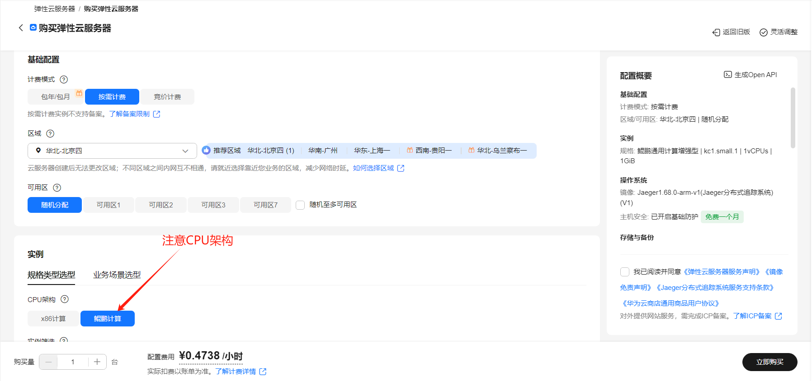

# llama.cpp Inference Framework
## Product Link
[llama.cpp Inference Framework](https://marketplace.huaweicloud.com/intl/hidden/contents/6fa48dca-33e9-4922-9090-ea87415b4354)

## Product Description
[llama.cpp](https://github.com/ggml-org/llama.cpp) is written purely in C/C++ without any external dependencies, delivering optimal performance and cross-platform compatibility that runs smoothly from embedded devices to high-performance servers.

Specially optimized for large language model inference, it supports quantization techniques and hardware acceleration, significantly reducing memory usage and computational costs while maintaining model quality.

Supports multiple hardware platforms including CPU, GPU (CUDA, OpenCL, Metal), and is compatible with operating systems like Windows, macOS, and Linux to meet various deployment needs.<br>
This product is provided as a pre-installed image on Huawei Cloud's HCE2.0 system (Kunpeng architecture).

## Purchase Guide
You can search for "llama.cpp Inference Framework" in the Cloud Marketplace.<br>
For region and specifications, use the recommended configurations. Choose between pay-as-you-go/monthly/annual billing based on your needs - pay-as-you-go for short-term use, monthly/annual for long-term use. Click "Buy Now" after confirming configurations.


### Deploy Directly Using RFS Template

After filling required fields, click Next


After creating deployment plan, click Confirm


Click Deploy to execute plan

"Apply required resource success" indicates successful creation


### ECS Console Configuration
#### Prerequisites

Before ECS console configuration, you need to configure **security group rules** in advance.

> **Security group rules configuration:**
> - Allow inbound port 8080, with source IP including your client IP (otherwise inaccessible)
> - Allow inbound port `22` for CloudShell connections (for console debugging)
> - Enable all outbound traffic

#### Creating ECS

After preparation, navigate to [ECS Purchase](https://support.huaweicloud.com/qs-ecs/ecs_01_0103.html) from ECS console. ECS resource configuration as shown:

Select CPU architecture

Select server specifications

Select image

Complete other parameters as needed, then click "Buy Now"


> **Important Notes:**
- You may create your own VPC
- Select the security group configured in [**Prerequisites**](#prerequisites);
- For Elastic IP, choose "Pay-by-traffic" (recommended) with 5Mbit/s bandwidth;
- Advanced configuration requires custom data injection, so select "Set later" for login credentials;
- Keep other settings as default or configure accordingly.

 ## Usage Guide
 
 ### Access llama.cpp on Server
```shell
# Interactive CLI
llama-cli -h

# HTTP service
llama-server -h
``` 

 ### Model Testing
Manually download GGUF format model files (e.g. Qwen3-0.6B-Q8_0.gguf, bge-m3-q4_k_m.gguf, bge-reranker-v2-m3-Q4_K_M.gguf) and modify paths in commands below:

```shell
# Chat model
# Server
llama-server -m Qwen3-0.6B-Q8_0.gguf --host 0.0.0.0
# Client
curl http://localhost:8080/completion \
-H "Content-Type: application/json" \
-d '{"prompt": "hello", "n_predict":12}'

# Embedding model
# Server
llama-server -m bge-m3-q4_k_m.gguf --embedding --host 0.0.0.0
# Client
curl http://localhost:8080/embedding \
-H "Content-Type: application/json" \
-d '{"content": "your text here"}'

# Rerank model
# Server
llama-server -m bge-reranker-v2-m3-Q4_K_M.gguf --rerank --host 0.0.0.0
# Client
curl http://localhost:8080/rerank \
-H "Content-Type: application/json" \
-d '{"query": "today is monday",
    "documents":[
        "Tomorrow is Tuesday",
        "I like English"
    ]}'
```

 ### Documents
 [llama-cli](https://github.com/ggml-org/llama.cpp/blob/master/tools/main/README.md)
 [llama-server](https://github.com/ggml-org/llama.cpp/blob/master/tools/server/README.md)
