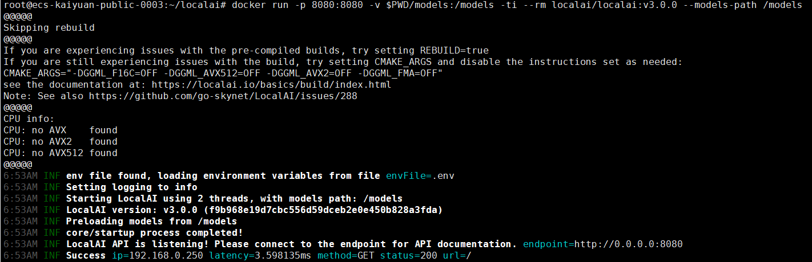

# llama.cpp推理框架
## 商品连接
[llama.cpp推理框架](https://marketplace.huaweicloud.com/hidden/contents/afe5ad26-ef91-47ab-ba58-735c167af8b0#productid=OFFI1151329778610204672)

## 商品说明
[llama.cpp](https://github.com/ggml-org/llama.cpp)采用纯 C/C++ 编写，无需任何外部依赖， 提供最佳的性能和跨平台兼容性，从嵌入式设备到高性能服务器都能流畅运行。
专为大语言模型推理优化，支持量化技术和硬件加速， 在保持模型质量的同时显著降低内存占用和计算成本。
支持 CPU、GPU（CUDA、OpenCL、Metal）等多种硬件平台， 兼容 Windows、macOS、Linux 等操作系统，满足各种部署需求。<br>
本商品在鲲鹏云的上HCE2.0系统中进行安装后以镜像提供给用户使用。

## 商品购买
您可以在云商店搜索“llama.cpp推理框架”。<br>
其中，地域、规格、按照推荐配置使用，购买方式根据您的需求选择按需/按月/按年，短
期使用推荐按需，长期使用推荐按月/按年，确认配置后点击“立即购买”。



### 使用 RFS 模板直接部署

必填项填写后，点击 下一步


创建直接计划后，点击 确定


点击部署，执行计划

如下图“Apply required resource success. ”即为资源创建完成


### ECS控制台配置
#### 准备工作

在使用ECS控制台配置前，需要您提前配置好 **安全组规则**。

> **安全组规则的配置如下：**
> - 入方向规则放通端口8080，源地址内必须包含您的客户端ip，否则无法访问
> - 入方向规则放通 CloudShell 连接实例使用的端口 `22`，以便在控制台登录调试
> - 出方向规则一键放通

#### 创建ECS

前提工作准备好后，选择 ECS 控制台配置跳转到[购买ECS](https://support.huaweicloud.com/qs-ecs/ecs_01_0103.html) 页面，ECS 资源的配置如下图所示：

选择CPU架构

选择服务器规格

选择镜像

其他参数根据实际请客进行填写，填写完成之后，点击立即购买即可


> **值得注意的是：**
- VPC 您可以自行创建
- 安全组选择 [**准备工作**](#准备工作) 中配置的安全组；
- 弹性公网IP选择现在购买，推荐选择“按流量计费”，带宽大小可设置为5Mbit/s；
- 高级配置需要在高级选项支持注入自定义数据，所以登录凭证不能选择“密码”，选择创建后设置；
- 其余默认或按规则填写即可。

 ## 商品使用
 
 ### 登录服务器查看 llama.cpp
```shell
# 交互式命令行
llama-cli -h

# http服务
llama-server -h
``` 

 ### 体验模型
手工下载gguf格式的模型文件（例如Qwen3-0.6B-Q8_0.gguf 、bge-m3-q4_k_m.gguf、 bge-reranker-v2-m3-Q4_K_M.gguf） 然后根据路径修改下面的命令行

```shell
# 聊天模型
# 服务端
llama-server -m Qwen3-0.6B-Q8_0.gguf --host 0.0.0.0
#客户端
curl http://localhost:8080/completion \
-H "Content-Type: application/json" \
-d '{"prompt": "hello", "n_predict":12}'

# Embedding模型
# 服务端
llama-server -m bge-m3-q4_k_m.gguf --embedding --host 0.0.0.0
#客户端
curl http://localhost:8080/embedding \
-H "Content-Type: application/json" \
-d '{"content": "your text here"}'

# Rerank模型
# 服务端
llama-server -m bge-reranker-v2-m3-Q4_K_M.gguf --rerank --host 0.0.0.0
#客户端
curl http://localhost:8080/rerank \
-H "Content-Type: application/json" \
-d '{"query": "today is monday",
    "documents":[
        "Tomorrow is Tuesday",
        "I like English"
    ]}'
```

 ### 社区文档
 [llama-cli](https://github.com/ggml-org/llama.cpp/blob/master/tools/main/README.md)
 [llama-server](https://github.com/ggml-org/llama.cpp/blob/master/tools/server/README.md)
